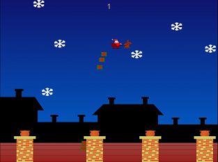

Santa's Quest
=============

Javascript game inspired by Christmas.

Using same architecture as Phat Parrot this game adds scaling and touch controls to work on all devices with a browser.

The aim of the game is to deliver as many presents down the chimneys as you fly over them as possible, without getting hit by pesky concrete snowflakes the size of Mars, augering into the ground or smashing into the chimneys themselves. Santa, Rudolph and their sleigh have a healthy attraction to the ground, via gravity and their not inconsiderable mass, that must be constantly averted by energetic mashing of the up arrow key or frantic tapping till your phone screen cracks!

Controls

* up-arrow/tap               Stay in the air in a stupendous parabolic roller-coaster ride.
* left-arrow / swipe-left    Dodge to the left.
* right-arrow / swipe-right  Dodge to the right.
* down-arrow / swipe-down    --Shit-- Shoot pressies out yer rear!
